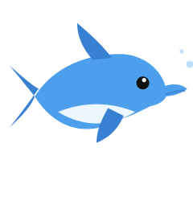
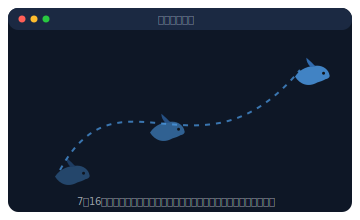
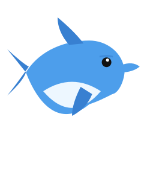

<div align="center">



# MacKairu（マッカイル）🐬

**消しても消えても戻ってくる、Mac の常駐コンシェルジュAI。**

かつて Windows にいたイルカの末裔。Windows から Mac に乗り換えたあなたに、操作のコツを教えます。ついでに、めちゃくちゃ邪魔します。


</div>

---

> **⚠️ 注意:** このアプリは終了しても **15分以内に勝手に戻ってきます**。これは仕様です。バグではありません。安心してください、設定でオフにできます（オフにすると少し寂しそうにします）。

## これは何

Mac の操作（「スクショどうやるの？」「アプリの切り替えは？」）を、画面の隅に浮かぶイルカにいつでも聞けるネイティブ macOS アプリです。中身は **Claude / OpenAI / Gemini** を切り替えて使えます。

…が、本体はどちらかというと **"うっとうしさ"** の方です。

<div align="center">

</div>

## 主な機能（まじめ版）

| 機能 | 説明 |
|---|---|
| 常駐イルカ | 透明・最前面・Dock非表示。クリックで質問、ドラッグで移動、ピンチで拡大 |
| AI 切り替え | Claude / OpenAI / Gemini。設定画面でキーを貼るだけ |
| 安全なキー保管 | `~/.config/mac-concierge/credentials.json`（権限600）。Keychainのパスワード地獄なし |
| ベクター描画 | キャラは画像アセット不要。コードで描いてるので無限に拡大しても綺麗 |

## 取り込んで聞く（便利版）

入力欄の左の2つのボタンで、**いま見てるもの**についてそのまま聞けます。

- **クリップボード取り込み**（📋）: ⌘C したテキスト（や画像）を取り込んで「翻訳／要約／説明」をワンタップ。
- **スクショで質問**（▣）: ボタンを押すと範囲選択スクショが起動 → 撮った画面を Vision で見て「この画面どう操作するの？」に答える。Mac 移行者の「この設定どこ？」に効きます。

文脈を取り込むとクイック操作チップが出るので、質問を打たなくても1タップでOK。（Vision は Claude / OpenAI / Gemini 対応）

## 主な機能（うざい版）

### 🏊 勝手に泳ぐ
放っておくと **7〜16秒ごと**に画面の端から端まで勝手に泳いで移動します。捕まえないと質問できません。**大きくするほど泳ぐ距離も伸びます。**

<div align="center">

</div>

### 🍔 太る
チャット履歴が増えるほど、イルカが太っていきます。

<div align="center">

&nbsp;&nbsp;&nbsp;➡️&nbsp;&nbsp;&nbsp;

<br>
<sub>左: 新品 ／ 右: 30メッセージ後</sub>
</div>

ゴミ箱ボタンで履歴をクリアすると、スッとスリムに戻ります。罪悪感ゼロのダイエット。

### 🗣 勝手に話しかける
30〜70秒おきに「保存した？ ⌘S だよ」「僕の話、聞いてる？」「消されてもまた来るからね」などと話しかけてきます。Clippy のDNA。

### 💀 消すのが大変
終了しようとすると、**3回**引き止められます。しかも各ダイアログで「消す」と「やめる」の**位置がランダムに入れ替わる**ので、連打では一生消えません。

```
┌────────────────────────────────────┐
│  本当に消すの…？                     │
│  僕、Mac のことなら何でも教えるのに…  │
│                                    │
│        [ 消す ]   [ やっぱりやめる ] │  ← 位置は毎回ランダム
└────────────────────────────────────┘
```

**正式な消し方（メメ）:** チャット欄に「**お前を消す方法**」と打って送信すると、別れの一言とともに一発で消えます。…でも15分後に戻ってきます。

## 使い方

```sh
git clone https://github.com/tatsunoritojo/MacKairu.git
cd MacKairu
swift test        # 24 テスト
./build.sh        # Kairu.app を生成
open Kairu.app    # 常駐開始
```

初回起動でイルカが出たら、メニューバーの🐬 →「設定…」で API キーを貼って保存。以上。

## 構成（SwiftPM）

ロジック（テスト可能）と UI を分離しています。

```
Sources/
  KairuCore/    ← 純粋ロジック（設定・各社API・太り具合・自己消去判定）＋テスト対象
  Kairu/        ← UI（常駐パネル・イルカ描画・泳ぎ・設定）
Tests/KairuCoreTests/   ← 24 テスト
```

## FAQ

**Q. 仕事中に泳いで邪魔なんですが。**
A. 設定の「おせっかい（うざ）モード」をオフにしてください。泳ぎ・話しかけ・引き止めが全部止まります。

**Q. どうしても消えません。**
A. 仕様です。チャットに「お前を消す方法」と打つか、復活トグルをオフにしてから消してください。

**Q. これ、役に立つの？**
A. Mac の操作は本当に教えてくれます。それ以外は…まあ、かわいいので。

## ライセンス

MIT License © tatsunoritojo

<div align="center">
<sub>🐬 You can run, but you can't delete.</sub>
</div>
