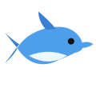
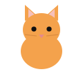
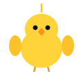
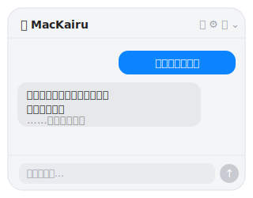
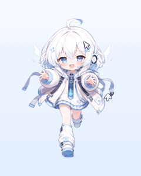

<div align="center">

&nbsp;&nbsp;&nbsp;&nbsp;&nbsp;&nbsp;

# MacKairu

**Desktop Mascot Assistant**

Mac の隅にいる、ちょっと賢くて、ちょっと邪魔な常駐マスコット。

`日本語` ・ [English](README.en.md) ・ [`ura-JP`](docs/secret.md)

<br>


</div>

---

## Overview

**MacKairu（マッカイル）** は、画面の隅に住みつくネイティブ macOS のデスクトップ・マスコットです。
透明・最前面・Dock 非表示で常駐し、クリックすれば **Mac の操作をいつでも教えてくれる**コンシェルジュとして働きます。

Windows から Mac に乗り換えたばかりでも安心。「スクショは？」「アプリ切り替えは？」を、画面を見ながら答えます。
…ただし本人は、わりとマイペースに泳ぎ回ります。

<div align="center">

</div>

## Characters

好きな相棒を選べます。メニューバー → 「キャラクター」、または設定から切替。

| | キャラ | 性格 |
|:--:|---|---|
| 🐬 | **イルカ** | 初代。Windows のあの子の末裔 |
| 🐱 | **ねこ** | きまぐれ。すぐどこかへ行く |
| 🐧 | **ペンギン** | のんびり。安定感がある |
| 🐤 | **ひよこ** | 小さくて軽い。ぴよぴよ |

## Features

| | 機能 | 説明 |
|:--:|---|---|
| 💬 | **AI に質問** | Claude / OpenAI / Gemini を切替。設定でキーを貼るだけ |
| 📋 | **取り込んで聞く** | クリップボードや**スクショ**を渡して「これ翻訳」「この画面どう操作？」（Vision 対応） |
| 🎛 | **自由自在** | ドラッグで移動、ピンチで拡大（最大10倍）、キャラ切替 |
| 🌊 | **マイペース** | 放っておくと勝手に画面を泳ぎ回り、たまに話しかける |
| 🍩 | **話すほど太る** | 会話が積もるとだんだん丸くなる。履歴をクリアするとスリムに戻る |
| 🔒 | **安全なキー保管** | `~/.config/mac-concierge/credentials.json`（権限600）。平文をどこにも残さない |

> 静かにしてほしい時は、設定の「おせっかいモード」をオフに。

## Install

ネイティブ SwiftPM プロジェクト。追加ランタイム不要。

```sh
git clone https://github.com/tatsunoritojo/MacKairu.git
cd MacKairu
swift test        # 34 tests
./build.sh        # Kairu.app を生成
open Kairu.app    # 常駐開始
```

起動したらメニューバーの絵文字 → 「設定…」で API キーを貼って保存。以上。

## Architecture

ロジック（テスト可能）と UI を分離した、見通しのよい構成。

```
Sources/
  KairuCore/   純粋ロジック（設定・各社API・キャラ定義） + 34 tests
  Kairu/       UI（常駐パネル・ベクター描画・状態管理）
Resources/     キャラ画像アセット
```

- ネイティブ SwiftUI / AppKit（Electron 不使用、軽量）
- 動物キャラは**コードでベクター描画**（画像アセット不要・無限に拡大しても綺麗）

---

<div align="center">

> 噂では、ある言葉を唱えると、別の住人が顔を出すらしい。
> その入口は、上のナビにある見慣れない “言語” のなか。

</div>

## License

MIT License © tatsunoritojo

<div align="center">
<sub>You can run, but you can't delete.</sub>

<br><br>

<a href="docs/secret.md"></a>
<br>
<sub><a href="docs/secret.md">…?</a></sub>

</div>
