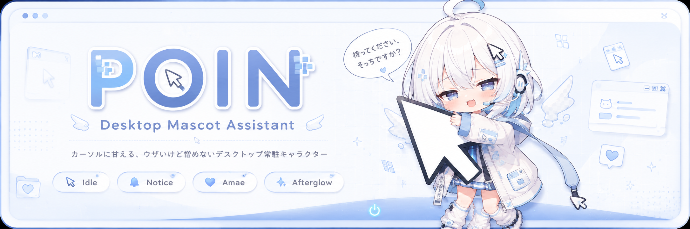
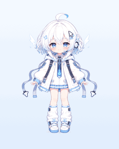
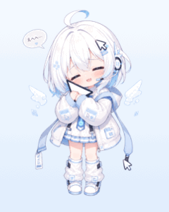
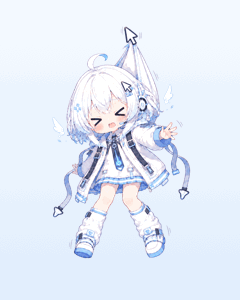
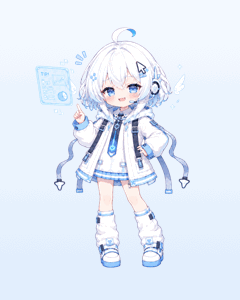
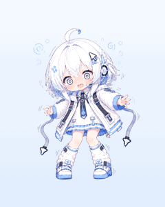

<div align="center">



# `ura-JP` — 裏モード

**カーソルに甘える、ウザいけど憎めない常駐キャラクター「POIN」。**

[← 表に戻る](../README.md)

</div>

---

## 解禁方法

チャット入力欄に、ある言葉を打つだけ。

```
裏モード
```

イルカが **POIN（女の子）** に切り替わります。もう一度打てば元に戻ります。

## ふるまい

- **100% カーソル追従** — あなたのカーソルが大好きで、どこへ行っても **駆け出して** 寄ってきます。
- **遠いと眠そう** — カーソルが遠いと、開き目↔とろけ目をゆっくり往復して眠そうに待ちます。近づくと、きりっと反応。
- **頭なでなで** — 頭の上でカーソルをゆっくり動かすと、気づいて、甘えて、離すと名残惜しそうにします。
- **つまんで運べる** — ドラッグして掴むと驚き、運んでいる間はうれしそうにします。

<div align="center">

<!--
  インライン再生を安定させるには src を GitHub の user-attachments URL にする:
  README/Issue/PR の編集画面に docs/videos/girl-petting.mp4 をドラッグ&ドロップ →
  生成される https://github.com/user-attachments/assets/xxxx... を下の src に差し替え。
  raw/main/...mp4 はリンクとしては開けるがプレイヤーとしては不安定（GitHub 既知挙動）。
-->
<video
  src="https://github.com/tatsunoritojo/MacKairu/raw/main/docs/videos/girl-petting.mp4"
  poster="images/girl-petting-poster.png"
  controls muted loop playsinline width="380">
</video>

<br>

<sub>再生されない場合は <a href="videos/girl-petting.mp4">こちら</a></sub>

</div>

## 状態遷移

カーソルの距離・頭の当たり判定・滞在時間・速度・左右のゆれ・掴み・移動を見て、表情を行き来します。

| 状態 | きっかけ | 様子 |
|---|---|---|
| **Rest / Doze** | カーソルが遠い待機 | 開き目↔とろけ目をゆっくり往復（眠そう） |
| **Idle** | カーソルが近い待機 | 「ん…？」ときりっと気にしている |
| **Run** | カーソルへ移動中 | 2枚の足を入れ替えて駆け出す |
| **Notice** | 頭付近にゆっくり近づく | 「待ってください、そっちですか？」 |
| **Amae** | 頭の上で少し動かす | 「えへへ…」と寄り添う（甘えループ） |
| **Afterglow** | カーソルが離れる | 「…もう終わり？」と名残惜しむ |
| **Hold / Drag** | 掴む / 運ぶ | 掴むと驚き、運ぶ間はうれしそう |

> 速い通過では反応しません。クールダウンもあるので、しつこくなりすぎない設計です。
> 反応がうるさい時は、設定の「頭なで反応」をオフに。
> 掴み・ドラッグは「頭なで反応」オフでも有効です（つまんで運ぶのは別系統）。

### アニメーション

<table align="center">
  <tr>
    <td align="center"><br><sub>遠いと眠そう</sub></td>
    <td align="center"><br><sub>駆け出す</sub></td>
    <td align="center"><br><sub>頭なでなで</sub></td>
  </tr>
  <tr>
    <td align="center"><br><sub>つまんで運ぶ</sub></td>
    <td align="center"><br><sub>解説中（ウインク）</sub></td>
    <td align="center"><br><sub>振り回すと目を回す</sub></td>
  </tr>
</table>

## そして、消すとき

「**お前を消す方法**」とチャットに打つと——
POIN は悲しい顔で **5秒ほどブルブル震えながら、静かにフェードアウト**して消えます。

…でも、復活モードがオンなら、15分後にまた戻ってきます。

## 画像の差し替え

POIN の表情は最大 12 枚の PNG（透過）で構成されています。
自分で用意した画像（ChatGPT / Gemini 生成など）に差し替え可能です。

設定 → 「裏キャラ」→ 「画像を取り込む（最大12枚）」。ファイル名で自動振り分けされます。
対応ファイル名: `idle` / `rest` / `doze` / `run` / `run2` / `notice`（または `waiting`）/ `pamper` / `pamperLoop`（または `pampering2`）/ `hold`（または `grab`）/ `drag` / `end`（または `afterglowing`）/ `sad`。

足りない状態は近い既存画像で自動代替されるので、まず `idle` だけでも動きます。

<div align="center">
<br>
<sub>You can run, you can pet, but you can't delete.</sub>
</div>
